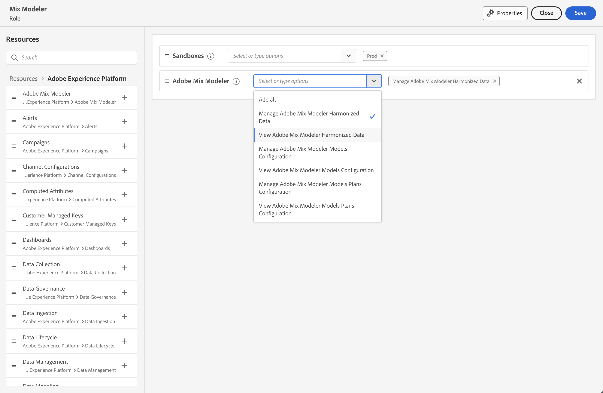

# Administración

Utilice el [Adobe Admin Console](https://helpx.adobe.com/es/enterprise/using/admin-console.html) para administrar productos y usuarios de Mix Modeler.

Para que Mix Modeler funcione correctamente, debe establecer los permisos correctos.

En la IU de Adobe Experience Cloud:

1. Seleccionar **[!UICONTROL Permissions]** desde el carril izquierdo, debajo de **[!UICONTROL ADMINISTRATION]**.

1. Seleccionar  **[!UICONTROL Roles]** en el panel izquierdo.

1. Seleccione una función existente o cree una función con **[!UICONTROL Create role]** (por ejemplo, **Mix Modeler**). Si selecciona una función existente, seleccione  **[!UICONTROL Edit]** para editar los permisos de la función. Consulte [Administrar funciones](https://helpx.adobe.com/es/enterprise/using/admin-console.html) para obtener más información.

1. Asegúrese de haber seleccionado una o más zonas protegidas para la función.

1. Añada el **Adobe Mix Modeler** a la lista de recursos del rol.

1. Asegúrese de seleccionar la **[!UICONTROL Adobe Mix Modeler]** permisos para la función que está configurando. Puede seleccionar una o varias de las siguientes funciones:

   - **[!UICONTROL View Adobe Mix Modeler Harmonized Data]**
   - **[!UICONTROL Manage Adobe Mix Modeler Harmonized Data]**
   - **[!UICONTROL View Adobe Mix Modeler Models Configuration]**
   - **[!UICONTROL Manage Adobe Mix Modeler Models Configuration]**
   - **[!UICONTROL View Adobe Mix Modeler Plans Configuration]**
   - **[!UICONTROL Manage Adobe Mix Modeler Plans Configuration]**

     

1. Asegúrese de seleccionar permisos adicionales para la función. Por ejemplo, para ver o administrar conjuntos de datos y esquemas, seleccionaría:

   - **[!UICONTROL Data Management]**: seleccione las opciones relevantes: **[!UICONTROL View Datasets]** o **[!UICONTROL Manage Datasets]**.

   - **[!UICONTROL Data Modeling]**: seleccione las opciones relevantes: **[!UICONTROL Manage Schemas]** o **[!UICONTROL View Schemas]**.

   <!--
    * **[!UICONTROL Data Governance]**: ensure you select **[!UICONTROL View User Activity Log]** and **[!UICONTROL View Data Usage Policies]**.
    -->

   <!---->

   Seleccionar **[!UICONTROL Save]** para guardar los permisos.

1. Entrada **[!UICONTROL Details]** dentro **[!UICONTROL Role]**, añada el adecuado **[!UICONTROL Users]** o **[!UICONTROL User groups]** para proporcionar a los usuarios acceso a Mix Modeler.
