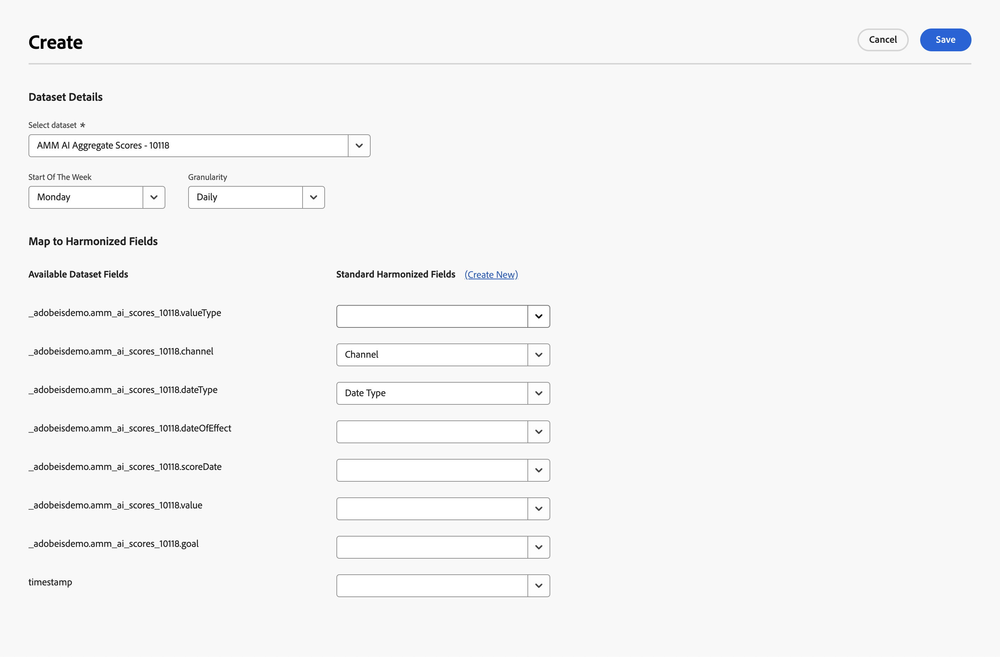

# Reglas de conjuntos de datos

Las reglas de conjuntos de datos le ayudan a asignar los campos armonizados con campos de los datos introducidos en Mix Modeler.

* Para los datos agregados que ha introducido en Adobe Experience Platform, asigne uno o más de los campos de conjunto de datos disponibles a los campos armonizados correspondientes.
* Para los datos de evento, puede asignar individualmente uno o más campos armonizados a campos del conjunto de datos, directamente o mediante condiciones.

## Administrar reglas de conjuntos de datos

Para ver una tabla de las reglas de conjuntos de datos disponibles, en la interfaz del Mix Modeler:

1. Seleccionar  **[!UICONTROL Harmonized data]** desde el carril izquierdo.

1. Seleccionar **[!UICONTROL Dataset rules]** desde la barra superior. Verá una tabla de las reglas del conjunto de datos.

Las columnas de la tabla especifican detalles sobre las reglas del conjunto de datos:

| Nombre de columna | Detalles |
| ---------------------- | ----------|
| Conjunto de datos | Nombre del conjunto de datos. |
| Fuente | El origen del conjunto de datos: Adobe Analytics, Eventos de experiencia, Resumen (agregado) o Eventos de experiencia del consumidor. |
| Esquema | Esquema al que se ajusta el conjunto de datos. Puede seleccionar rápidamente el nombre del esquema para abrirlo en una nueva pestaña del editor de esquemas en  [Esquemas](../ingest-data/schemas.md). |
| Granularidad | La granularidad de los datos del conjunto de datos. Los valores posibles son Diario, Semanal, Mensual o Anual. |
| Inicio de semana | Especifica qué día de la semana se considera el inicio de una nueva semana para el conjunto de datos específico. |
| Estado | El estado del campo: 
● Borrador o 
● Activo |
| Última modificación | Datos y hora de la última modificación de la regla del conjunto de datos. |

{style="table-layout:auto"}

### Crear una regla de conjunto de datos

Para crear una regla de conjunto de datos, en la variable  **[!UICONTROL Harmonized data]** > **[!UICONTROL Dataset rules]** interfaz en Mix Modeler, seleccione **[!UICONTROL Create a dataset rule]** en el **[!UICONTROL Dataset rules configuration]** asistente.

En el **[!UICONTROL Create]** pantalla,

1. Entrada **[!UICONTROL Dataset details]**, seleccione un conjunto de datos de **[!UICONTROL Select dataset]** para comenzar la configuración. En la lista, los conjuntos de datos se clasifican en **[!UICONTROL Consumer Experience Events]**, **[!UICONTROL Adobe Analytics]**, **[!UICONTROL Experience Event]** y, **[!UICONTROL Summary]**.

1. Seleccione un día para la **[!UICONTROL Start of the week]**.

1. Seleccionar **[!UICONTROL Daily]**, **[!UICONTROL Weekly]**, **[!UICONTROL Monthly]** o **[!UICONTROL Yearly]** para **[!UICONTROL Granularity]**.

1. Cuando haya seleccionado un conjunto de datos del **[!UICONTROL Summary]** categoría:

   1. Para definir si los datos del conjunto de datos se agregan o reemplazan a los datos existentes, seleccione **[!UICONTROL Aggregation]** o **[!UICONTROL Replacement]** para **[!UICONTROL Data restatement is by]**.

   1. Asigne cada uno de los **[!UICONTROL Available dataset fields]** a correspondiente **[!UICONTROL Standard harmonized fields]** in **[!UICONTROL Map to harmonized fields]**. Si no desea asignar un campo de conjunto de datos a un campo armonizado, seleccione explícitamente **[!UICONTROL -- None --]**.

   1. Si necesita un nuevo campo armonizado, no disponible en la lista, seleccione **[!UICONTROL Create New]** para crear un nuevo campo armonizado. Verá el cuadro de diálogo como se describe en [Añadir un nuevo campo armonizado](fields.md#add-a-harmonized-field).

   1. Cuando finalice la asignación de todos los campos de la regla, seleccione **[!UICONTROL Save as draft]** para guardar una versión de borrador de la regla o **[!UICONTROL Save]** para guardar y activar la regla. Seleccionar **[!UICONTROL Cancel]** para cancelar la configuración de la regla.

      

1. Cuando haya seleccionado un conjunto de datos de categoría de evento (**[!UICONTROL Experience Events]**, **[!UICONTROL Adobe Analytics]**, **[!UICONTROL Consumer Experience Events]**), en el cuadro siguiente **[!UICONTROL Map to harmonized fields]**:

   1. Seleccione un campo armonizado de **[!UICONTROL Standard harmonized field]**.

   1. Cuando el campo armonizado seleccionado es del tipo métrica:

      1. Seleccionar **[!UICONTROL Count]** o **[!UICONTROL Sum]** de **[!UICONTROL Mapping type]**.

      1. Seleccione un **[!UICONTROL *Campo del conjunto de datos AEP *]**que desea que el campo armonizado se asigne a de forma predeterminada.

   1. Cuando el campo seleccionado es de tipo dimensión:

      1. Seleccionar **[!UICONTROL Map Into]** o **[!UICONTROL Case]** de **[!UICONTROL Mapping type]**.

      1. Cuando haya seleccionado **[!UICONTROL Map Into]**, seleccione **[!UICONTROL Field]** y **[!UICONTROL *Campo del conjunto de datos AEP *]**o **[!UICONTROL Value]**y un valor predeterminado para asignar el campo armonizado de forma predeterminada al campo del conjunto de datos o al valor introducido.

      1. Al seleccionar **[!UICONTROL Case]**, seleccione **[!UICONTROL Field]** y **[!UICONTROL *Campo del conjunto de datos AEP *]**o **[!UICONTROL Value]**y un valor predeterminado para asignar el campo armonizado de forma predeterminada al campo del conjunto de datos o al valor introducido.

         1. Para establecer valores de forma explícita, defina uno o más casos, que consten de una o más condiciones. Cada condición puede comprobar una condición específica **[!UICONTROL *Campo del conjunto de datos AEP *]**ya sea **[!UICONTROL Exists]**o **[!UICONTROL Not Exists]**o si **[!UICONTROL Contains]**,**[!UICONTROL Not Contains]**,**[!UICONTROL Equals]**,**[!UICONTROL Not Equals]**,**[!UICONTROL Starts With]**, o **[!UICONTROL Ends With]**un valor introducido en**[!UICONTROL * Introducir valor de entrada *]**.

         1. Para añadir otro caso, seleccione  **[!UICONTROL Add case]**, para añadir otra condición, seleccione  **[!UICONTROL Add condition]**.

         1. Para eliminar un caso o condición, seleccione  en el contenedor correspondiente.

         1. Para seleccionar si alguna o todas las condiciones deben aplicarse a un caso, seleccione **[!UICONTROL Any of]** o **[!UICONTROL All of]**.

         1. Para establecer el valor de resultado de un caso, introduzca el valor en **[!UICONTROL Then]**.

      El ejemplo siguiente

      * utiliza un **[!UICONTROL Map Into]** **[!UICONTROL Mapping type]** para asignar el **[!UICONTROL Channel Type At Source]** campo armonizado para el **[!UICONTROL channel_type]** del campo **[!DNL Luma Transactions]** conjunto de datos.

      * utiliza un **[!UICONTROL Case]** **[!UICONTROL Mapping type]** para asignar de forma condicional el valor de **[!UICONTROL marketing.campaignName]** en el campo **[!DNL Luma Transactions]** conjunto de datos a **[!UICONTROL Campaign]** campo armonizado. El campo Campaña armonizada se establece en:

         * `Black Friday` cuando la variable **[!UICONTROL marketing.campaignName]** es `_black_friday` o `BlackFriday`.
         * al valor del **[!UICONTROL marketing.campaignName]** en todos los demás casos.

        

1. Seleccionar  **[!UICONTROL Add field]** para definir campos adicionales.

Cuando termine, seleccione **[!UICONTROL Save as draft]** para guardar una versión de borrador de la regla o **[!UICONTROL Save]** para guardar y activar la regla. Seleccionar **[!UICONTROL Cancel]** para cancelar la configuración de la regla.

### Editar una regla de conjunto de datos

Para editar una regla de conjunto de datos, en la variable  **[!UICONTROL Harmonized data]** > **[!UICONTROL Dataset rules]** interfaz en el Mix Modeler:

1. Seleccionar  en el **[!UICONTROL Dataset]** para la regla del conjunto de datos que desea editar.
1. En el menú contextual, seleccione  **[!UICONTROL Edit]** para empezar a editar la regla del conjunto de datos. Consulte [Crear una regla de conjunto de datos](#create-a-dataset-rule) para obtener más información.

### Eliminar una regla del conjunto de datos

Para eliminar una regla del conjunto de datos, en la variable  **[!UICONTROL Harmonized data]** > **[!UICONTROL Dataset rules]** interfaz en el Mix Modeler:

1. Seleccionar  en el **[!UICONTROL Dataset]** para la regla del conjunto de datos que desea eliminar.
1. En el menú contextual, seleccione  **[!UICONTROL Delete]** para eliminar la regla del conjunto de datos. Se le pedirá confirmación. Seleccionar **[!UICONTROL Delete]** para eliminar la regla del conjunto de datos seleccionado de forma permanente.

## Sincronizar datos

Para sincronizar datos entre los datos armonizados y los conjuntos de datos de resumen o evento, siga toda la lógica de las reglas del conjunto de datos:

1. Seleccione **[!UICONTROL Sync data]**.

1. Desde el **[!UICONTROL Sync data for dataset rules]** diálogo, seleccione
   * **[!UICONTROL Refresh harmonized data for summary datasets]**,
   * **[!UICONTROL Refresh harmonized data for event datasets]**, o
   * **[!UICONTROL Refresh harmonized data for both summary + event datasets]**.

1. Para iniciar la sincronización en función de las reglas del conjunto de datos definidas entre los datos armonizados y los datos de conjuntos de datos, seleccione **[!UICONTROL Sync]**. Para cancelar la sincronización, seleccione **[!UICONTROL Cancel]**.

   

## Preferencias de combinación de datos

>[!NOTE]
>
>[!BADGE beta]{type=Informative}

Las preferencias de combinación de datos ayudan a resolver conflictos cuando se combinan datos de fuentes de datos resumidas y de evento. Los casos de uso son:

* la misma métrica publicitaria se mide y se comunica en varios conjuntos de datos, o
* la medición de métricas puede estar incompleta en algunos conjuntos de datos, mientras que otro conjunto de datos puede ser un superconjunto de una métrica en particular, lo que resulta en un recuento doble.

Para garantizar predicciones de modelos precisas, puede definir las preferencias de combinación de datos:

1. Seleccionar  [!BADGE beta].

1. En el **[!UICONTROL Data merge preferences]** [!BADGE beta]{type=Informative}

   

   * Seleccione una **[!UICONTROL Default metric preference]**. La preferencia de métrica predeterminada seleccionada se aplica cuando, durante la armonización, varias fuentes de datos actualizan un campo de métrica para un canal determinado. La preferencia se aplica en el nivel de zona protegida, a menos que se anule para las preferencias específicas basadas en métricas. Puede seleccionar entre **[!UICONTROL Summary data]**, **[!UICONTROL Event data]** y **[!UICONTROL Sum of summmary and event data]**.

   * Para agregar preferencias basadas en métricas específicas:

      1. Seleccionar  **[!UICONTROL Add a metric]**.
         1. Seleccione una métrica del **[!UICONTROL *Selección de métricas *]**lista.
         1. Seleccionar **[!UICONTROL CHANNELS]** o **[!UICONTROL CONVERSION TYPES]**. En la lista, seleccione **[!UICONTROL All]** o un canal o tipo de conversión específico.
         1. Seleccionar **[!UICONTROL Summary]** o **[!UICONTROL Event]** para especificar si se prefieren los datos de resumen o los datos de evento para la métrica (y todo el canal o el canal seleccionado) al combinar datos.

         Para agregar uno o más canales adicionales o tipos de conversión:

         1. Seleccionar  **[!UICONTROL Add a channel]** o  **[!UICONTROL Add a conversion type]**.
         1. Seleccione **[!UICONTROL Summary]** o **[!UICONTROL Event]**.

         Para eliminar un canal o un tipo de conversión, seleccione .

      1. Para agregar preferencias basadas en métricas más específicas, repita el paso anterior.

   * Para eliminar una preferencia específica basada en métricas, seleccione .

1. Seleccionar **[!UICONTROL Save]** para guardar las preferencias de combinación de datos. Se inicia una resincronización de los datos.  Seleccionar **[!UICONTROL Cancel]** para cancelar.

## Control de acceso de nivel de campo

Experience Platform Al configurar reglas de conjuntos de datos para conjuntos de datos armonizados, el [control de acceso basado en atributos](https://experienceleague.adobe.com/en/docs/experience-platform/access-control/abac/overview) se aplica en el nivel de campo. Un campo está restringido cuando se adjunta una etiqueta a un campo de esquema y se habilita una directiva activa que deniega el acceso a ese campo. Como resultado:

* no ve los campos de esquema que están restringidos al crear una regla de conjunto de datos,
* no puede ver ni editar la asignación de uno o varios campos de esquema que están restringidos. Cuando edita o ve una regla del conjunto de datos que contiene estos campos restringidos, verá la siguiente pantalla.
  
