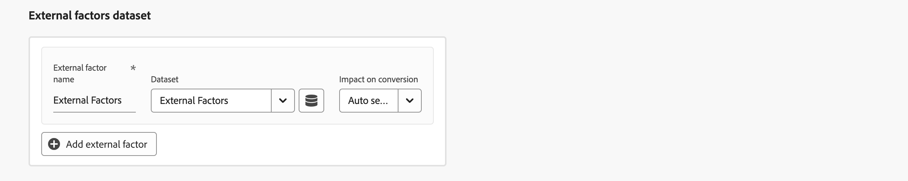
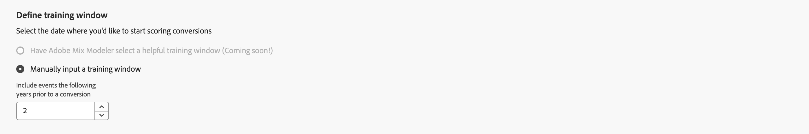

# Creación de un modelo

Para crear un modelo, en la  **[!UICONTROL Models]** interfaz en Mix Modeler, seleccione **[!UICONTROL Open model canvas]**.

Para crear sus modelos personalizados con tecnología de IA, la interfaz proporciona un flujo de configuración de modelo guiado paso a paso.

1. En el **[!UICONTROL Setup]** paso:

   1. Introduzca el modelo **[!UICONTROL Name]**, por ejemplo `Demo model`. Introduzca una **[!UICONTROL Description]**, por ejemplo `Demo model to explore AI featues of Mix Modeler`.

      

   1. Seleccionar **[!UICONTROL Next]** para continuar con el paso siguiente. Seleccionar **[!UICONTROL Cancel]** para cancelar la configuración del modelo.

1. En el **[!UICONTROL Configure]** paso:

   1. En el **[!UICONTROL Conversion goal]** dentro del contenedor:

      1. Introduzca una **[!UICONTROL Conversion name]** para la conversión, por ejemplo `Conversion`

      1. Seleccione una conversión de **[!UICONTROL *Seleccionar campo armonizado *]**, que contiene las conversiones disponibles definidas como parte de [Conversiones](../harmonize-data/conversions.md) in [!UICONTROL Harmonized datasets]. Por ejemplo,**[!UICONTROL Online Conversion]**.

      1. Puede seleccionar  **[!UICONTROL Create new conversion]** para crear una conversión directamente desde la configuración del modelo.

         

   1. En el **[!UICONTROL Marketing touchpoints]** , verá una serie de contenedores de puntos de contacto de marketing, correspondientes a los puntos de contacto de marketing definidos como parte de [Puntos de contacto de marketing](../harmonize-data/marketing-touchpoints.md) in [!UICONTROL Harmonized datasets].

      * Para cada contenedor:

         1. Puede modificar la variable **[!UICONTROL Marketing touchpoint name]**.

         1. Seleccione un punto de contacto de marketing de **[!UICONTROL _Seleccionar punto de contacto de marketing_]**.

         1. Puede seleccionar  **[!UICONTROL Create new marketing touchpoint]** para crear un punto de contacto de marketing directamente desde la configuración del modelo.

      * Para añadir un contenedor de punto de contacto de marketing, seleccione  **[!UICONTROL Add marketing touchpoint]**.

      * Para quitar un contenedor de punto de contacto de marketing, dentro del contenedor, seleccione y seleccione **[!UICONTROL Remove container]** en el menú contextual.

        

   1. De forma predeterminada, se genera una puntuación para todos los datos de la vista armonizada. Para puntuar solo un subconjunto de la población, defina uno o más filtros con contenedores en la variable **[!UICONTROL Eligible data population]** sección.

      * Para cada contenedor, defina uno o más eventos.

         1. Para cada evento:

            1. Seleccionar una métrica o dimensión de **[!UICONTROL _Seleccionar campo armonizado_]**.

            1. Seleccione el operador adecuado: **[!UICONTROL equals]**, **[!UICONTROL not equals]**, **[!UICONTROL less than]**, **[!UICONTROL greater than]**, **[!UICONTROL starts with]**, **[!UICONTROL doesn't start with]**, **[!UICONTROL ends with]**, **[!UICONTROL doesn't end with]**, **[!UICONTROL contains]**, **[!UICONTROL doesn't contain]**, **[!UICONTROL is in]**, o **[!UICONTROL is not in]**.

            1. Introduzca o seleccione un valor en **[!UICONTROL _Introduzca o seleccione un valor_]**.

         1. Para añadir un evento adicional en el contenedor, seleccione  **[!UICONTROL Add event]**.

         1. Para quitar un evento del contenedor, seleccione .

         1. Para filtrar utilizando todos o cualquiera de los varios eventos definidos en el contenedor, seleccione **[!UICONTROL Any of]** o **[!UICONTROL All of]**. La etiqueta cambia en consecuencia de **[!UICONTROL Include ... Or ...]** hasta **[!UICONTROL Include ... And ...]**.

      * Para añadir un contenedor de población de datos apto, seleccione  **[!UICONTROL Add eligible population]**.

      * Para eliminar un contenedor de población de datos apto, dentro del contenedor, seleccione y seleccione **[!UICONTROL Remove marketing touchpoint]** en el menú contextual.

        

   1. Para agregar conjuntos de datos que contengan factores externos al modelo, utilice uno o más contenedores en la variable **[!UICONTROL External factors dataset]** sección.

      * Para cada contenedor:

         1. Introduzca una **[!UICONTROL Factor name]** en **[!UICONTROL _Introducir factor_]**.

         1. Seleccionar un conjunto de datos de **[!UICONTROL _Seleccionar un conjunto de datos_]**. Puede seleccionar  para administrar conjuntos de datos. Consulte [Conjuntos de datos](../ingest-data/datasets.md) para obtener más información.

      * Para añadir un contenedor de conjunto de datos de factores externos adicional, seleccione  **[!UICONTROL Add external factor]**.

      * Para quitar un contenedor de conjunto de datos de factores externos, dentro del contenedor, seleccione y seleccione **[!UICONTROL Remove external factor]** en el menú contextual.

        

   1. Para agregar conjuntos de datos que contengan factores internos al modelo, utilice uno o más contenedores en la variable **[!UICONTROL Internal factors dataset]** sección.

      * Para cada contenedor:

         1. Introduzca una **[!UICONTROL Factor name]** en **[!UICONTROL _Introducir factor_]**.

         1. Seleccionar un conjunto de datos de **[!UICONTROL _Seleccionar un conjunto de datos_]**. Puede seleccionar  para administrar conjuntos de datos. Consulte [Conjuntos de datos](../ingest-data/datasets.md) para obtener más información.

      * Para agregar un contenedor de conjunto de datos de factores internos adicional, seleccione  **[!UICONTROL Add internal factor]**.

      * Para quitar un contenedor de conjunto de datos de factores internos adicional, dentro del contenedor, seleccione , y **[!UICONTROL Remove internal factor]** en el menú contextual.

        

   1. Para definir la ventana retrospectiva del modelo, introduzca un valor entre `1` y `52` in **[!UICONTROL Give contribution credit to touchpoints occurring within]** ... **[!UICONTROL weeks prior to the conversion]**.

   1. Seleccionar **[!UICONTROL Next]** para continuar con el paso siguiente. Si se necesita más configuración, un contorno rojo y texto explican qué configuración adicional se requiere.  Seleccionar **[!UICONTROL Back]** para volver al paso anterior.  Seleccionar **[!UICONTROL Cancel]** para cancelar la configuración del modelo.

1. En el **[!UICONTROL Advanced]** paso:

   1. En el **[!UICONTROL Define training window]** sección, seleccionar entre

      * **[!UICONTROL Have Mix Modeler select a helpful training window]** y

      * **[!UICONTROL Manually input a training window]**. Cuando se seleccione, definir el número de años en **[!UICONTROL Include events the following years prior to a conversion]**.

        

   1. En el **[!UICONTROL Spend share]** sección:

      * Para utilizar relaciones de inversión de marketing históricas para informar al modelo cuando los datos de marketing son dispersos, active **[!UICONTROL Allow spend share]**.

   1. En el **[!UICONTROL Prior knowledge]** sección:

      1. Seleccione el **[!UICONTROL Rule type]**.

      1. Especifique los porcentajes de contribución para cualquiera de los canales enumerados en **[!UICONTROL Name]**, usando el **[!UICONTROL Contribution proportion]** columna.

      1. Si procede, puede agregar para cada canal un **[!UICONTROL Level of confidence]** porcentaje.

      1. Cuando sea necesario, utilice **[!UICONTROL Clear all]** para borrar todos los valores de entrada del **[!UICONTROL Contribution proportion]** y **[!UICONTROL Level of confidence]** columnas.

         

1. Seleccionar **[!UICONTROL Finish]** para finalizar la configuración del modelo.

   * En el **[!UICONTROL Create instance?]** diálogo, seleccione **[!UICONTROL Ok]** para almacenar en déclencheur el primer conjunto de entrenamientos y ejecuciones de puntuación inmediatamente. El modelo aparece con el estado. ● **[!UICONTROL Awaiting training]**.

     Seleccionar **[!UICONTROL Cancel]** para cancelar.

   * Si se necesita más configuración, un contorno rojo y texto explican qué configuración adicional se requiere.

   Seleccionar **[!UICONTROL Back]** para volver al paso anterior.

   Seleccionar **[!UICONTROL Cancel]** para cancelar la configuración del modelo.
