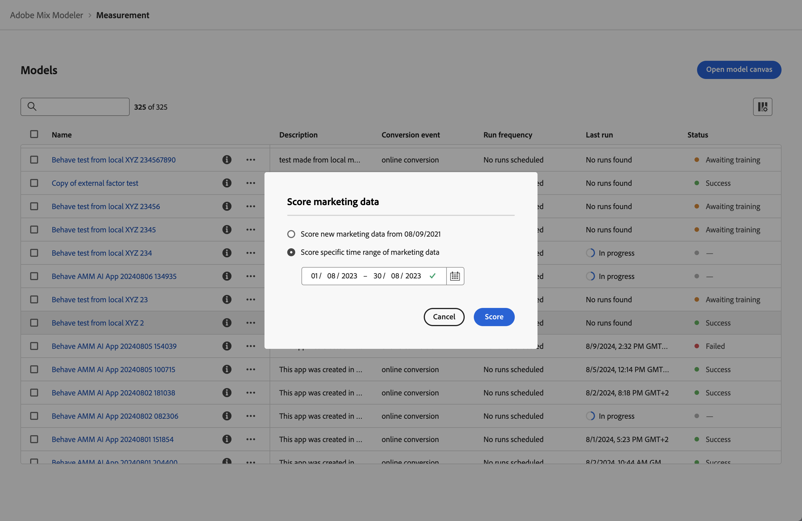

# Información general de modelos

La funcionalidad de modelo de Mix Modeler le permite configurar, entrenar y puntuar modelos específicos para sus objetivos comerciales. La formación y la puntuación admiten el aprendizaje de transferencia impulsado por IA entre la atribución multitáctil y el modelado de combinación de marketing.

Los modelos se basan en los datos armonizados que crea como parte del flujo de trabajo de la aplicación Mix Modeler.

Un modelo en Mix Modeler es un modelo de aprendizaje automático empleado para medir y predecir un resultado especificado en función de las inversiones de un experto en marketing. Se pueden utilizar puntos de contacto de marketing y datos de nivel de resumen como entrada. Mix Modeler le permite crear variantes de modelos basadas en diferentes conjuntos de variables, dimensiones y resultados, como ingresos, unidades vendidas o posibles clientes.

Un modelo requiere:

* Una conversión.
* Uno o más puntos de contacto de marketing (canales) compuestos de datos de nivel de resumen, datos de punto de contacto de marketing (datos de evento) o ambos.
* Una ventana retrospectiva configurable.
* Una ventana de formación configurable.

Un modelo puede incluir de forma opcional:

* Factores externos.
* Factores internos.
* Conocimiento previo de las contribuciones de marketing de otras fuentes, como la experiencia previa de las partes interesadas, las pruebas graduales y otros modelos.
* Porcentaje de gasto, que utiliza el porcentaje de gasto relativo como proxy cuando los datos de marketing son escasos.

Cuando se crea un modelo por primera vez, la creación inicia inmediatamente el proceso de formación y puntuación. Una vez finalizada la formación inicial y la ejecución de puntuación, las perspectivas del modelo están disponibles para su revisión. Un modelo puede ser entrenado posteriormente. Además, se pueden añadir datos al modelo, lo que requiere que vuelva a puntuar el modelo manualmente. Volver a entrenar y a puntuar son un proceso iterativo a medida que surgen nuevos hallazgos e información, y se necesitan ajustes para obtener un modelo de ajuste que sea más apropiado para sus objetivos comerciales.

## Modelos de compilación

Para generar un modelo, use el flujo de configuración del modelo guiado paso a paso de Mix Modeler disponible al seleccionar **[!UICONTROL Open model canvas]**. Consulte [Modelos de compilación](build.md) para obtener más información.

## Administrar modelos

Para ver una tabla de los modelos actuales, en la interfaz de Mix Modeler:

1. Seleccione  **[!UICONTROL Models]** en el carril izquierdo.

1. Verá una tabla de los modelos actuales.

   Las columnas de la tabla especifican detalles sobre el modelo.

   | Nombre de columna | Detalles |
   |---|---|
   | Nombre | Nombre del modelo |
   | Descripción | Descripción del modelo |
   | Evento de conversión | La conversión que ha seleccionado para el modelo. |
   | Frecuencia de ejecución | Frecuencia de ejecución del aprendizaje del modelo. |
   | Última ejecución | La fecha y hora de la última formación del modelo. |
   | Estado | El estado del modelo. |

   {style="table-layout:auto"}

   El estado del modelo del que se informa depende de dónde se encuentre un modelo dentro de su ciclo de vida. Por ejemplo, si un modelo se ha creado, si se ha vuelto a entrenar correctamente o no, o si se ha marcado o no correctamente.

   En la tabla siguiente:

   * : indica una ejecución correcta de un paso en el ciclo de vida del modelo.
   * : indica una ejecución en curso actual de un paso en el ciclo de vida del modelo.
   *  - indica una ejecución fallida de un paso en el ciclo de vida del modelo.

   | Estado | Crear | Entrenar | Puntuación | Reentrenar | Rescore |
   |---|:---:|:---:|:---:|:---:|:---:|
   | En curso |  | | | | |
   | En curso |  |  | | | |
   | En curso |  |  |  | | |
   | En curso |  |  |  |  | |
   | En curso |  |  |  |  |  |
   | Error de formación |  |  | | | |
   | Error de formación |  |  |  |  | |
   | Formación completada correctamente |  |  | | | |
   | Formación completada correctamente |  |  |  |  | |
   | Error de puntuación |  |  |  | | |
   | Error de puntuación |  |  |  |  |  |
   | Puntuación correcta |  |  |  | | |
   | Puntuación correcta |  |  |  |  |  |

   {style="table-layout:fixed"}

1. Para cambiar las columnas mostradas en la lista, seleccione  y active o desactive las columnas .

Puede realizar las siguientes acciones en un modelo específico.

### Datos del modelo

La funcionalidad de perspectivas del modelo solo está disponible en modelos entrenados y puntuados correctamente.

Para ver las perspectivas de un modelo:

1. Seleccione  **[!UICONTROL Models]** en el carril izquierdo.

1. Seleccione el nombre del modelo.

Se le redirigirá a [Información del modelo](insights.md).

### Ver detalles

Para ver más detalles de un modelo:

1. Seleccione  **[!UICONTROL Models]** en el carril izquierdo.

1. Seleccione  para que un modelo muestre una ventana emergente con detalles.

### Duplicar

Puede duplicar rápidamente un modelo.

1. Seleccione  **[!UICONTROL Models]** en el carril izquierdo.

1. Seleccione  para un modelo y, en el menú contextual, seleccione **[!UICONTROL Duplicate]**.

Se le redirigirá a los pasos para crear un nuevo modelo, con un nombre propuesto compuesto por el nombre del modelo original anexado con **[!UICONTROL (Copy)](_n_)**.

### Editar

Puede editar el nombre, la descripción y la programación de la formación y la puntuación de un modelo.

1. Seleccione  **[!UICONTROL Models]** en el carril izquierdo.

1. Seleccione  para un modelo y, en el menú contextual, seleccione **[!UICONTROL Edit]**.

   En el diálogo **[!UICONTROL Edit model]**:

   * Escriba un nuevo(a) **[!UICONTROL Name]** y **[!UICONTROL Description]**.

   * Para habilitar la programación, habilite **[!UICONTROL Status]**. Solo se puede activar la programación de modelos que se hayan entrenado y clasificado.

      1. Seleccionar un **[!UICONTROL Scoring frequency]**:

         * **[!UICONTROL Daily]**: escriba una hora válida (por ejemplo, `05:22 pm`) o use .
         * **[!UICONTROL Weekly]**: seleccione un día de la semana e introduzca una hora válida (por ejemplo, `05:22 pm`) o use .
         * **[!UICONTROL Monthly]**: selecciona un día del mes en el menú desplegable Ejecutar en cada e introduce una hora válida (por ejemplo, `05:22 pm`) o usa .

      1. Seleccione un(a) **[!UICONTROL Training frequency]** del menú desplegable: **[!UICONTROL Monthly]**, **[!UICONTROL Quarterly]**, **[!UICONTROL Yearly]** o **[!UICONTROL None]**.

     

1. Seleccione **[!UICONTROL Save]**.

### Reentrenar

La opción Volver a entrenar un modelo sólo está disponible en modelos que se hayan entrenado correctamente.

Considere la posibilidad de volver a entrenar un modelo cuando desee:

* Incluya nuevos datos de factor y marketing incremental. Por ejemplo: en el último trimestre, la dinámica del mercado ha cambiado o la distribución de datos de marketing ha cambiado significativamente.

Para volver a entrenar un modelo:

1. Seleccione  **[!UICONTROL Models]** en el carril izquierdo.

1. Seleccione  para un modelo y, en el menú contextual, seleccione **[!UICONTROL Train]**. También puede seleccionar  **[!UICONTROL Train]** en la barra de acciones azul.

   En el cuadro de diálogo **[!UICONTROL Train model]**, seleccione la opción para:

   * **[!UICONTROL Train model with last 2 years of marketing data]**, o
   * **[!UICONTROL Train model using specific date range of data]**.
Especifique el intervalo de fecha. Puede usar el  para seleccionar un intervalo de fechas. Debe seleccionar un rango de datos con un mínimo de un año.

   

1. Seleccione **[!UICONTROL Train]** para volver a entrenar el modelo.

### Puntuación o rescore

Puede puntuar gradualmente un modelo basado en nuevos datos de marketing o volver a puntuar un modelo para un intervalo de fechas específico.

Considere volver a marcar un modelo cuando desee:

* Corrija los datos de marketing incorrectos. Por ejemplo, los datos de búsqueda de pago recientes que ha incluido en la formación y puntuación del modelo omiten una semana de datos.
* Utilice los nuevos datos de marketing incremental que están disponibles a través de las actualizaciones en los conjuntos de datos configurados como parte de los datos armonizados.

Para puntuar o volver a puntuar un modelo:

1. Seleccione  **[!UICONTROL Models]** en el carril izquierdo.

1. Seleccione  para un modelo y, en el menú contextual, seleccione **[!UICONTROL Score]**. También puede seleccionar  **[!UICONTROL Score]** en la barra de acciones azul.

   En el cuadro de diálogo **[!UICONTROL Score marketing data]**, seleccione la opción para:

   * **[!UICONTROL Score new marketing data from *mm/dd/aaaa *]**, para puntuar el modelo gradualmente con nuevos datos de marketing, o
   * **[!UICONTROL Score specific date range of marketing data]** para volver a anotar para un intervalo de fechas específico.
Especifique el intervalo de fecha. Puede usar el  para seleccionar un intervalo de fechas.

   

1. Seleccione **[!UICONTROL Score]**. Al volver a calificar un modelo con un intervalo de datos específico, verá un cuadro de diálogo de **[!UICONTROL Existing model is replaced]** que le pedirá que confirme que desea reemplazar el modelo con nuevas puntuaciones para el intervalo de fechas seleccionado. Seleccione **[!UICONTROL Replace model]** para confirmar.

>[!IMPORTANT]
>
>La repuntuación de un modelo no cambia ningún plan que ya se haya creado en función del modelo remarcado. Para utilizar el nuevo modelo de puntuación en un plan, debe crear un nuevo plan.

### Eliminar modelos

Para eliminar un modelo:

1. Seleccione  **[!UICONTROL Models]** en el carril izquierdo.
1. Seleccione  para un modelo y, en el menú contextual, seleccione **[!UICONTROL Delete]**. También puede seleccionar  **[!UICONTROL Delete]** de la barra de acciones azul.
1. Seleccione **[!UICONTROL Delete]** en el cuadro de diálogo de confirmación **[!UICONTROL Delete model]** para eliminar el modelo. Seleccione **[!UICONTROL Cancel]** para cancelar.

Para eliminar varios modelos:

1. Seleccione varios modelos.
1. En la barra de acciones azul, seleccione  **[!UICONTROL Delete]** para eliminar los modelos.
1. Seleccione **[!UICONTROL Delete]** en el cuadro de diálogo de confirmación de **[!UICONTROL Delete *x *modelos]**para eliminar los modelos. Seleccione **[!UICONTROL Cancel]**para cancelar.

