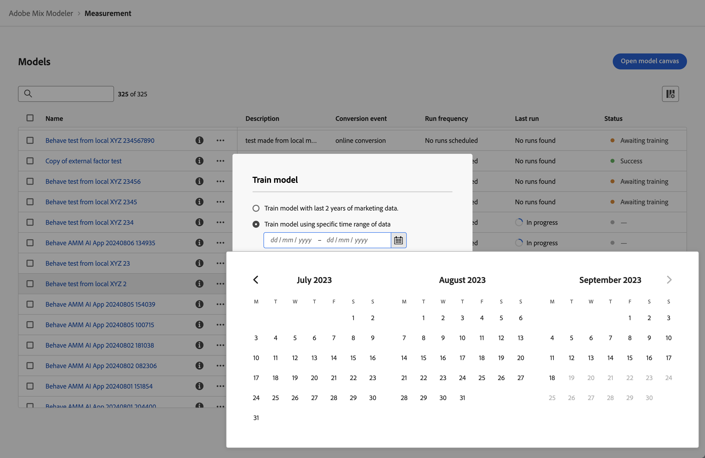
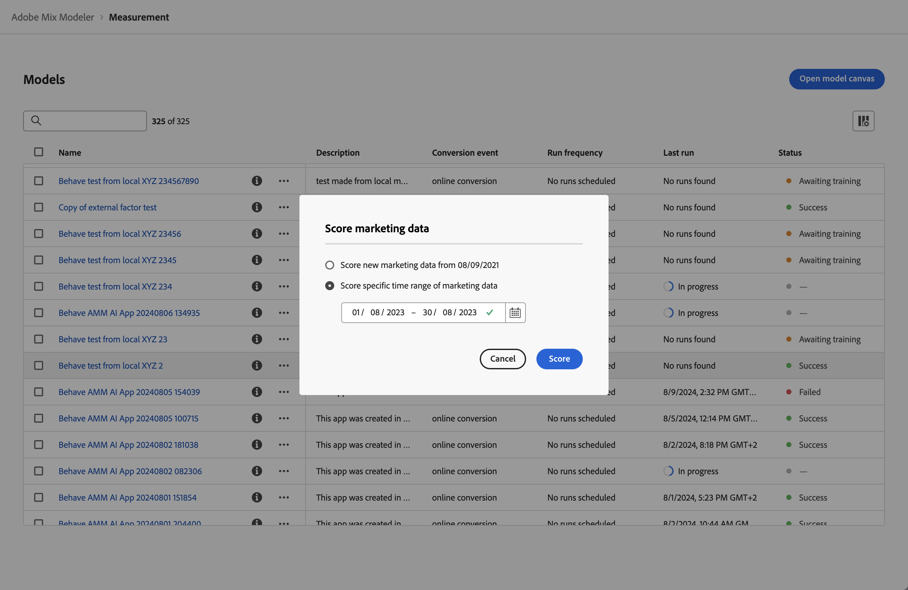

# Modelos de entrenamiento y puntuación

Después de haber [creado](/help/models/build.md) un modelo, este se entrena y puntúa automáticamente. Puede volver a entrenar un modelo manualmente o volver a marcarlo.

## Entrenar

Considere la posibilidad de volver a entrenar un modelo cuando desee incluir nuevos datos de factor y marketing incremental. Por ejemplo: en el último trimestre, la dinámica del mercado ha cambiado o la distribución de datos de marketing ha cambiado significativamente.

Para volver a entrenar un modelo:

1. Seleccione  **[!UICONTROL Models]** en el carril izquierdo.

1. Seleccione  para un modelo y, en el menú contextual, seleccione **[!UICONTROL Train]**. También puede seleccionar  **[!UICONTROL Train]** en la barra de acciones azul.

   En el cuadro de diálogo **[!UICONTROL Train model]**, seleccione la opción para:

   * **[!UICONTROL Train model with last 2 years of marketing data]**, o
   * **[!UICONTROL Train model using specific date range of data]**.
Especifique el intervalo de fecha. Puede usar el  para seleccionar un intervalo de fechas. Debe seleccionar un rango de datos con un mínimo de un año.

   

1. Seleccione **[!UICONTROL Train]** para volver a entrenar el modelo.

Solo se puede volver a entrenar un modelo si se ha entrenado correctamente.

## Puntuación

Puede puntuar gradualmente un modelo basado en nuevos datos de marketing o volver a puntuar un modelo para un intervalo de fechas específico.

Considere volver a marcar un modelo cuando desee:

* Corrija los datos de marketing incorrectos. Por ejemplo, los datos de búsqueda de pago recientes que ha incluido en la formación y puntuación del modelo omiten una semana de datos.
* Utilice los nuevos datos de marketing incremental que están disponibles a través de las actualizaciones en los conjuntos de datos configurados como parte de los datos armonizados.

Para puntuar o volver a puntuar un modelo:

1. Seleccione  **[!UICONTROL Models]** en el carril izquierdo.

1. Seleccione  para un modelo y, en el menú contextual, seleccione **[!UICONTROL Score]**. También puede seleccionar  **[!UICONTROL Score]** en la barra de acciones azul.

   En el cuadro de diálogo **[!UICONTROL Score marketing data]**, seleccione la opción para:

   * **[!UICONTROL Score new marketing data from *mm/dd/aaaa *]**, para puntuar el modelo gradualmente con nuevos datos de marketing, o
   * **[!UICONTROL Score specific date range of marketing data]** para volver a anotar para un intervalo de fechas específico.
Especifique el intervalo de fecha. Puede usar el  para seleccionar un intervalo de fechas.

   

1. Seleccione **[!UICONTROL Score]**. Al volver a clasificar un modelo con un intervalo de datos específico, verá un cuadro de diálogo de **[!UICONTROL Existing model is replaced]**, que le pedirá que confirme reemplazar el modelo con nuevas puntuaciones para el intervalo de fechas seleccionado. Seleccione **[!UICONTROL Replace model]** para confirmar.

>[!IMPORTANT]
>
>La repuntuación de un modelo no cambia ningún plan que ya se haya creado en función del modelo remarcado. Para utilizar el nuevo modelo de puntuación en un plan, debe crear un nuevo plan.
