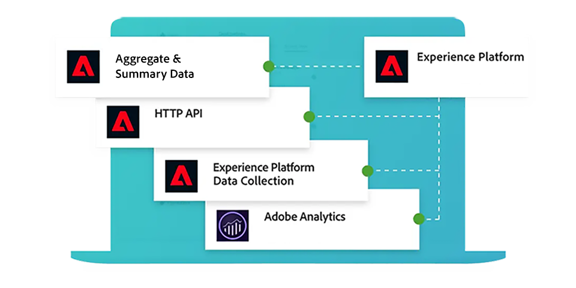

# Guía de Adobe Mix Modeler

Esta guía de documentación técnica proporciona ayuda para Adobe **Mix Modeler**. Mix Modeler es una aplicación de Adobe Experience Cloud que mide campañas y optimiza la planificación de forma integral en todos los canales: de pago, ganados y propios. Mix Modeler se basa en Adobe Experience Platform y funciona con Adobe Sensei.

## Empiece con lo básico

<table style="table-layout:fixed">
  <tr style="border: 0;">
    <td>
    
    
<strong>Inicio rápido</strong> Obtenga información general sobre y insight en el flujo de trabajo de Mix Modeler.

    </td>
    <td>
    
    
<strong>Ingesta de datos</strong> Aprenda a ingerir datos de eventos y agregados o de resumen en Mix Modeler.

    </td>
    <td>
    
    
<strong>Armonizar datos</strong> Aprenda a asimilar datos acumulados y de evento en una vista de datos coherente. 
    

    </td>
    <td>
    
    
<strong>Modelo y plan</strong> Entrena y puntúa tus modelos y usa las perspectivas para tus planes de marketing.

    </td>
  </tr>
  <tr style="border: 0;">
    <td align="center"></td>
    <td align="center"></td>
    <td align="center"></td>
    <td align="center"></td>
    </tr>
</table>

## Explorar la documentación

<table style="table-layout:fixed">
  <tr style="border: 0;">
    <td>
       
      <strong>Ingesta de datos</strong> <a href="/help/ingest-data/overview.md">Información general</a> - <a href="/help/ingest-data/schemas.md">Esquemas</a> - <a href="/help/ingest-data/datasets.md">Conjuntos de datos</a> 
    </td>
    <td>
       
      <strong>Armonizar datos</strong> <a href="/help/harmonize-data/overview.md">Información general</a> - <a href="/help/harmonize-data/fields.md">Campos</a> - <a href="/help/harmonize-data/dataset-rules.md">Reglas de conjuntos de datos</a> - <a href="/help/harmonize-data/marketing-touchpoints.md">Puntos de contacto de marketing</a> - <a href="/help/harmonize-data/conversions.md">Conversiones</a> - <a href="/help/harmonize-data/usage-report.md">Informe de uso</a>  
    </td>
    <td>
       
      <strong>Modelos</strong> <a href="/help/models/overview.md">Información general</a> - <a href="/help/models/build.md">Modelos de compilación</a> - <a href="/help/models/insights.md">Información del modelo</a> - <a href="/help/models/scoring-data.md">Usar datos de puntuación</a>
    </td>
  </tr>
  <tr style="border: 0;">
    <td>
       
      <strong>Planes</strong> <a href="/help/plans/overview.md">Planes</a> - <a href="/help/plans/build.md">Planes de compilación</a> - <a href="/help/plans/compare.md">Comparar planes</a> - <a href="/help/plans/build.md">Información del plan</a>
    </td>
    <td>
       
      <strong>Información general</strong> <a href="/help/dashboard/overview.md">Esquemas</a> - <a href="/help/dashboard/harmonized-data.md">Datos armonizados</a> - <a href="/help/dashboard/plans.md">Planes</a>
    </td>
        <td>
       
      <strong>Tutoriales</strong> <a href="https://experienceleague.adobe.com/docs/mix-modeler-learn/tutorials/overview.html?lang=es">Información general</a> - <a href="https://experienceleague.adobe.com/docs/mix-modeler-learn/tutorials/intro/use-cases.html?lang=es">Casos de uso</a> - <a href="https://experienceleague.adobe.com/docs/mix-modeler-learn/tutorials/intro/user-workflow.html?lang=es">Flujo de trabajo del usuario</a> - <a href="https://experienceleague.adobe.com/docs/mix-modeler-learn/tutorials/intro/user-interface-tour.html?lang=es">Recorrido de la interfaz de usuario</a>
    </td>
  </tr>
</table>

